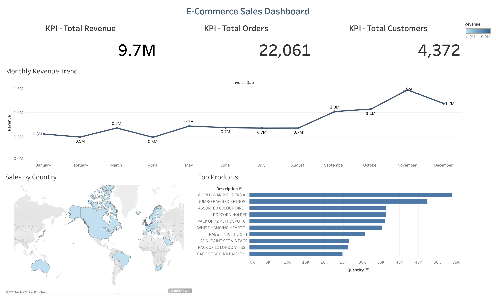

# Ecommerce Analytics Project
## Author: Tuong Phan

## Overview
This project analyzes ecommerce transaction data using SQL and SQLite to identify sales trends, customer behavior, product performance, and business KPIs.

## Tools Used
- SQL
- SQLite
- DB Browser for SQLite
- VS Code

## Dataset
The dataset contains ecommerce transactions including:
- Invoice data
- Product information
- Customer IDs
- Country information
- Quantity and pricing data

## Key Analysis
- Revenue analysis
- Top customers
- Top-selling products
- Revenue by country
- Cancelled order analysis
- Average Order Value (AOV)
- Data quality checks

## KPI Metrics
- Total Revenue
- Total Orders
- Total Customers
- Average Order Value

## Example Business Questions
- Which countries generate the most revenue?
- Which products sell the most?
- How many orders were cancelled?
- What is the average order value?
- Who are the top customers?

## Files
- ecommerce.db → SQLite database
- queries.sql → SQL queries used for analysis
- cleaned_orders.csv → exported cleaned dataset

## Tableau Public
[View Interactive Tableau Dashboard](https://public.tableau.com/app/profile/tuong.phan3177/viz/ecommerce_sales_dashboard_17783884766410/E-CommerceSalesDashboard#1)

## Dashboard Preview

  

